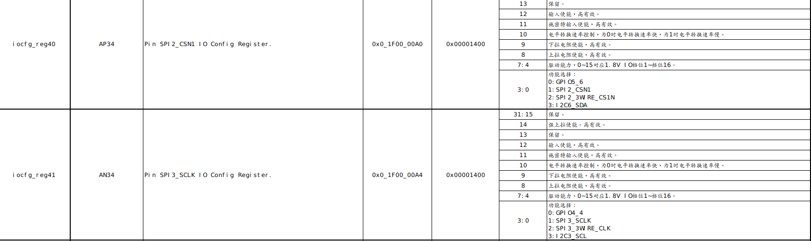

title: "Hi3559a_开发(五)-GPIO"
date: 2020-12-25T16:49:14+08:00
draft: false
tags: ["Hi3559a"]

# 一、概述

HI3559a拥有较多的GPIO，其中大部分GPIO都存在复用功能，当使用其他功能的时候需要设置复用功能，否则外设不能实现复用外设的功能，其中GPIO可以在linux和liteos中设置，其中linux中使用pinctrl统一管理，在liteos中使用寄存器设置，其设置寄存器的文件为《Hi3559AV100_PINOUT_CN.xlsx》。




如上退所示，通过设置一些寄存器便可以实现对GPIO引脚的第二功能进行配置，以及配置其GPIO输入输出方向。


# 二、 liteos操作

## 1. 基本操作

在liteos下提供基本的GPIO操作，但是不能提供复用功能设置，应该其只实现了基本的io操作。其驱动实现在```osdrv/platform/liteos_a53/liteos/drivers/gpio```下面实现。

```c
static struct gpio_ops pl061_ops = {
    .setdir        = pl061_setdir,
    .getdir        = pl061_getdir,
    .readbit       = pl061_readbit,
    .writebit      = pl061_writebit
};
```

在lite下面新建分支test_gpio.

```bash
git checkout -b test_gpio
```

新建user_gpio.c

```c
#include "user_gpio.h"

static int gpio_fd;

void user_gpio_initial(void){
    gpio_fd = open("/dev/gpio", O_RDWR);
    if(gpio_fd < 0){
        printf("can't open gpiochip\n");
    }
}

void user_gpio_setdir(uint8_t group, uint8_t pin, uint8_t Pdir){
    gpio_groupbit_info pin_str;

    pin_str.groupnumber = group;
    pin_str.bitnumber = pin;
    pin_str.direction = Pdir;
    ioctl(gpio_fd, GPIO_SET_DIR, &pin_str);
}

void user_gpio_write(uint8_t group, uint8_t pin, uint8_t value){
    gpio_groupbit_info pin_str;

    pin_str.groupnumber = group;
    pin_str.bitnumber = pin;
    pin_str.value = value;
    ioctl(gpio_fd, GPIO_WRITE_BIT, &pin_str);
}

uint8_t user_gpio_read(uint8_t group, uint8_t pin){
    gpio_groupbit_info pin_str;

    pin_str.groupnumber = group;
    pin_str.bitnumber = pin;
    pin_str.value = value;
    ioctl(gpio_fd, GPIO_READ_BIT, &pin_str); 

    return pin_str.value;
}

void user_gpio_test(void){
    user_gpio_setdir(4,1,GPIO_DIR_OUT);

    user_gpio_write(4,1,1); 
    LOS_Mdelay(100);
    user_gpio_write(4,1,0); 
    LOS_Mdelay(100);

    user_gpio_write(4,1,1); 
    LOS_Mdelay(100);
    user_gpio_write(4,1,0); 
    LOS_Mdelay(100);

    user_gpio_write(4,1,1); 
    LOS_Mdelay(100);
    user_gpio_write(4,1,0); 
    LOS_Mdelay(100);
}
```

新建user_gpio.h

```c
#ifndef __USER_GPIO_H__
#define __USER_GPIO_H__

#include "user.h"

void user_gpio_initial(void);
void user_gpio_setdir(uint8_t group, uint8_t pin, uint8_t Pdir);
void user_gpio_write(uint8_t group, uint8_t pin, uint8_t value);
uint8_t user_gpio_read(uint8_t group, uint8_t pin);

void user_gpio_test(void);


#endif
```

在主函数中调用user_gpio_test()，编译后烧录到板上，便可以操作GPIO4_1。

## 2.复用功能

由于默认的GPIO都是设置为通用的GPIO功能，部分引脚设置为模块功能(在驱动中有设置)，但是大部分的外设要使用都需要自行设置GPIO的复用功能，需要自行设置GPIO的复用功能。

在hal.h中设置了部分宏，方便设置寄存器。

```c
#define readl(address)          GET_UINT32(address)
#define writel(value, address)  WRITE_UINT32(value, address)
#define writeand(v,a)           writel(readl(a) & (v),a)
#define writeor(v,a)            writel(readl(a) | (v),a)
#define IOREG(N)                (0x1F000000 + N * 4)
```

如上图所示，GPIO5_6可以设置为多个功能，其具体设置为低两位。

| 低两位 | 功能         | 其他 |
| ------ | ------------ | ---- |
| 00     | GPIO         |      |
| 01     | SPI2_CSN1    |      |
| 10     | SPI2_3W_CSN1 |      |
| 11     | I2C6_SDA     |      |

如果要设置其功能为I2C6_SDA，那么调用如下函数即可。

```c
writeor(IOREG(40),3)		//寄存器40的低两位写入3
```

# 三、linux操作

linux下面的GPIO底层由pinctrl负责管理，中间层由gpiolib负责，顶层可以通过fs.h访问。

## 1.基本操作

### 1） shell操作


### 2） c语言操作


## 2.复用功能

