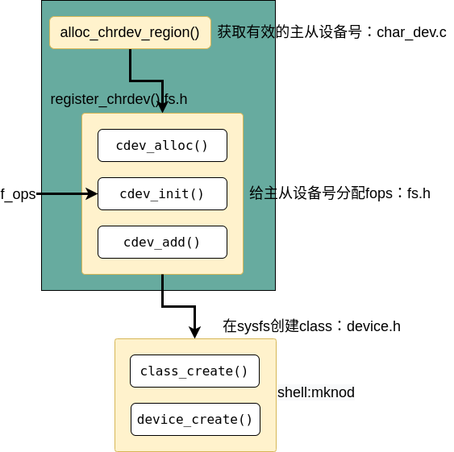

# 一、字符驱动

linux的驱动主要分为字符驱动、块驱动和网络驱动，字符驱动比较简单，容易上手。linux系统中一切皆是文件，驱动也不例外，用户程序在用户空间使用驱动主要是通过读写设备文件，并且对设备文件进行读写操作，因此实现驱动程序应该实现以下功能：

* 在文件系统中创建一个可以访问的文件
* 建立起读写打开等函数的实现
* 将读写打开等函数与创建的文件联系起来

# 二、初始例程

