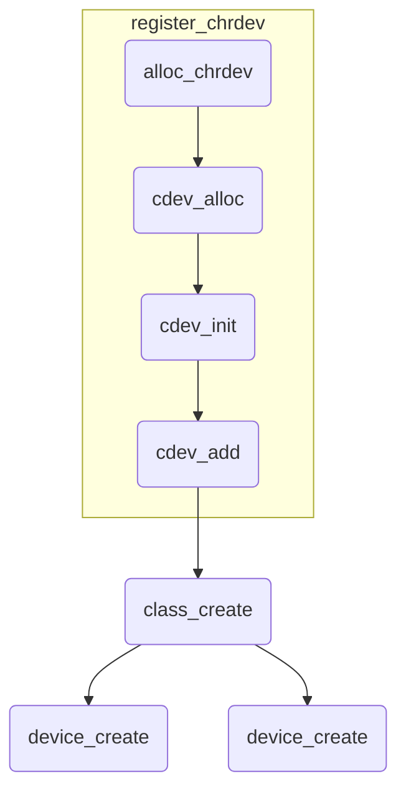

<div align = "center" style="font-size:48px">PWM复用驱动测试使用说明-linux</div>

[TOC]

# 一、概述

​		脉冲宽度调制是一种模拟控制方式，根据相应载荷的变化来调制晶体管，来实现晶体管或MOS导通时间的改变，从而实现开关稳压电源输出的改变。这种方式能使电源的输出电压在工作条件变化时保持恒定，是利用微处理器的数字信号对模拟电路进行控制的一种非常有效的技术。PWM调制是利用数字输出来对模拟电路进行控制的一种非常有效的技术，广泛应用在从测量、通信到功率控制与变换的许多领域中。

​		HI3559A芯片的CPU子系统分为两部分，一个是以为A73+A53为主的SOC部分，另一个是为M7为主的Sensor Hub部分，其中SOC子系统与Sensor Hub子系统的外设均采用统一的外设接口，即寄存器组完全一样，并且可以通过地址转换实现跨子系统访问，但是SOC子系统与Sensor Hub子系统的中断系统完全肚子，并不能完全共享中断向量。

​		主 SOC 子系统提供 1 组 2 路独立的脉宽调制信号输出。
​		Sensor Hub 子系统提供 1 组 8 路独立的脉宽调制信号输出


# 二、 参考文件

GPIO复用功能描述文件《Hi3559A V100_PINOUT_EN.xlsx》

驱动操作使用指南《外围设备驱动 操作指南.pdf》

寄存器相关操作《Hi3559A╱C V100 ultra-HD Mobile Camera SoC 用户指南.pdf》


# 三、驱动编译

​		linux的的字符串驱动一般作为platform驱动编译，platform驱动具有良好的移植性，但是设计起来较为复杂，本文就单文件驱动进行设计，linux驱动的设计步骤如下：

* 实现基本的驱动功能函数
* 申请主次设备号
* 申请cdev设备，初始化cdev并且设置相关函数
* 创建一个class设备，并且在class下创建device



​		系统提供的驱动部分的函数如下:

| 函数          | 说明                                                         |
| ------------- | ------------------------------------------------------------ |
| alloc_chrdev  | 申请一组可用的主从设备号，当主设备号为零的时候表明是动态分配 |
| cdev_alloc    | 申请一个可用的dev对象，用于存储操作函数相关的结构体          |
| cdev_init     | 将操作函数结构体赋值                                         |
| cdev_add      | 将cdev与主从设备号关联起来                                   |
| class_create  | 在/sys/class/路径下面创建一个类用于存储驱动相关信息          |
| device_create | 在class_create创建的类下面创建一个device，分配唯一的主从设备号，并且uevent给udev在/dev下面创建软连接 |


​		字符驱动的文件如下：

**Makefile**

```makefile
obj-m+=hipwm.o
# KERNEL_PATH = /lib/modules/$(shell uname -r)/build/
CROSS_COMPILE := aarch64-himix100-linux-
ARCH_TYPE = arm64
KERNEL_PATH = /workspace/02sdk/Hi3559AV100R001C02SPC020/01.software/board/Hi3559AV100_SDK_V2.0.2.0/osdrv/opensource/kernel/linux-4.9.y_multi-core/
all:
	make -C ${KERNEL_PATH} M=${PWD} ARCH=${ARCH_TYPE} CROSS_COMPILE=${CROSS_COMPILE} modules
clean:
	make -C $(KERNEL_PATH) M=$(PWD) clean

.PHONE:install remove

install:all
	sudo insmod hipwm.ko
	sudo dmesg -c | grep hipwm

remove:
	sudo rmmod hipwm
```

**hipwm.c**

```c
#include "hipwm.h"

void __iomem *hipwm0_int_base;
void __iomem *hipwm1_int_base;
void __iomem *hiperi_cfg_base;
uint8_t is_open = false;
static int tops_open(struct inode *inode,struct file *file){
    hipwm0_int_base = ioremap(PWM0_BASE, 128);    
    hipwm1_int_base = ioremap(PWM1_BASE, 128);    
    hiperi_cfg_base = ioremap(PERI_CRG101, 128);

    SYS_WRITELOR(hiperi_cfg_base, PWM_50M);
    SYS_WRITELOR(hiperi_cfg_base, EN_PWM);


    is_open = true;


	return 0;
}

static int tops_release(struct inode *inode,struct file *file){
    iounmap(hipwm0_int_base);
    iounmap(hipwm1_int_base);

	return 0;	
}

static ssize_t tops_read(struct file *file,char* buff,size_t count,loff_t *f_pos){

	return count;
}

static ssize_t tops_write(struct file *file,const char* buff,size_t count,loff_t *f_pos){

	return count;
}


uint32_t pwm0_freq = 0;
uint32_t pwm1_freq = 0;
uint32_t pwm0_duty = 0;
uint32_t pwm1_duty = 0;
uint32_t kk = 12;
static long tops_ioctl(struct file *file, unsigned int cmd, unsigned long arg){

    uint32_t val;

	if (_IOC_TYPE(cmd) == 'U') {
		switch (_IOC_NR(cmd)) {
            case _IOC_NR(HI_PWM0_REG_TOPS):
                if(copy_from_user((void*)&val, (void*)arg, sizeof(uint32_t))){
                    printk("copy from user err");
                    return -EFAULT;
                }
                
                pwm0_freq = val;
                break;
            case _IOC_NR(HI_PWM1_REG_TOPS):
                if(copy_from_user((void*)&val, (void*)arg, sizeof(uint32_t))){
                    printk("copy from user err");
                    return -EFAULT;
                }
                
                pwm1_freq = val;
                break;
            case _IOC_NR(HI_PWM0_REG_DUTY):
                if(copy_from_user((void*)&val, (void*)arg, sizeof(uint32_t))){
                    printk("copy from user err");
                    return -EFAULT;
                }
                
                pwm0_duty = val;
                SYS_WRITEL(PWM0_CFG0(hipwm0_int_base), pwm0_freq);
                SYS_WRITEL(PWM0_CFG1(hipwm0_int_base), pwm0_duty);
                SYS_WRITEL(PWM0_CTRL(hipwm0_int_base), 0x51);
                break;
            case _IOC_NR(HI_PWM1_REG_DUTY):
                if(copy_from_user((void*)&val, (void*)arg, sizeof(uint32_t))){
                    printk("copy from user err");
                    return -EFAULT;
                }
                
                pwm1_duty = val;
                SYS_WRITEL(PWM0_CFG0(hipwm1_int_base), pwm1_freq);
                SYS_WRITEL(PWM0_CFG1(hipwm1_int_base), pwm1_duty);
                SYS_WRITEL(PWM0_CTRL(hipwm1_int_base), 0x51);
                break;
        }
        
    }

    return 0;
}

const struct file_operations hipwm_fops = {
	.owner = THIS_MODULE,
	.read = tops_read,
	.write = tops_write,
	.open = tops_open,
	.release = tops_release,
    .unlocked_ioctl = tops_ioctl
};

static struct       class *dev_class;
static int 			major;
#define             HIPWM  "hipwm"

MODULE_LICENSE("GPL");              

//设置初始化入口函数
static int __init hipwm_init(void)
{
    printk(KERN_DEBUG "hipwm!!!\n");

    major = register_chrdev(0, HIPWM, &hipwm_fops);
	if (major < 0){
        printk(KERN_ALERT "can find valid majon\n");   
		return -EFAULT;
    }

	dev_class = class_create(THIS_MODULE, HIPWM);
	device_create(dev_class, NULL, MKDEV(major, 0), NULL, "hello_udev");

    return 0;
}

//设置出口函数
static void __exit hipwm_exit(void)
{
    class_destroy(dev_class);
	unregister_chrdev(major, HIPWM);
    printk(KERN_DEBUG "goodbye hipwm!!!\n");
}

//将上述定义的init()和exit()函数定义为模块入口/出口函数
module_init(hipwm_init);
module_exit(hipwm_exit);
```

**hipwm.h**

```c
#ifndef __HIPWM_H__
#define __HIPWM_H__

#include <linux/init.h>
#include <linux/kernel.h>
#include <linux/module.h>
#include <linux/fs.h>
#include <linux/cdev.h>
#include <linux/slab.h>
#include <linux/uaccess.h>
#include <linux/semaphore.h>
#include <linux/miscdevice.h>
#include <linux/vmalloc.h>
#include <linux/wait.h>
#include <linux/poll.h>
#include <linux/sched.h>
#include <linux/proc_fs.h>
#include <linux/seq_file.h>
#include <linux/mutex.h>
#include <linux/spinlock.h>
#include <linux/timer.h>
#include <asm/io.h>
#include <linux/delay.h>
#include <linux/kthread.h>
#include <linux/irq.h>
#include <linux/interrupt.h>
#include <linux/err.h>
#include <linux/device.h>
#include <linux/gpio.h>

#define	HI_USER_DRV  'U'

#define HI_PWM0_REG_TOPS  \
	_IOW(HI_USER_DRV, 0, uint32_t)
#define HI_PWM1_REG_TOPS  \
	_IOW(HI_USER_DRV, 1, uint32_t)
#define HI_PWM0_REG_DUTY  \
	_IOW(HI_USER_DRV, 2, uint32_t)
#define HI_PWM1_REG_DUTY  \
	_IOW(HI_USER_DRV, 3, uint32_t)

#define PWM0_BASE       0x12130000    
#define PWM1_BASE       0x12130020 
#define PERI_CRG101     0x12010194
#define EN_PWM          (1 << 19)
#define PWM_3M          (0 << 20)
#define PWM_24M         (2 << 20)
#define PWM_50M         (1 << 20)

#define PWM0_CFG0(b)    (b + 0) 
#define PWM0_CFG1(b)    (b + 4)
#define PWM0_CFG2(b)    (b + 8) 
#define PWM0_CTRL(b)    (b + 12)    
#define PWM0_STATE0(b)  (b + 16)  
#define PWM0_STATE1(b)  (b + 20)  
#define PWM0_STATE2(b)  (b + 24) 

#define SYS_WRITEL(Addr, Value)     ((*(volatile unsigned int *)(Addr)) = (Value))
#define SYS_WRITELOR(Addr, Value)   ((*(volatile unsigned int *)(Addr)) |= (Value))
#define SYS_READ(Addr)              (*((volatile int *)(Addr)))

#endif#ifndef __GPIOAF_H__
#define __GPIOAF_H__

#include <linux/init.h>
#include <linux/kernel.h>
#include <linux/module.h>
#include <linux/fs.h>
#include <linux/cdev.h>
#include <linux/slab.h>
#include <linux/uaccess.h>
#include <linux/semaphore.h>
#include <linux/miscdevice.h>
#include <linux/vmalloc.h>
#include <linux/wait.h>
#include <linux/poll.h>
#include <linux/sched.h>
#include <linux/proc_fs.h>
#include <linux/seq_file.h>
#include <linux/mutex.h>
#include <linux/spinlock.h>
#include <linux/timer.h>
#include <asm/io.h>
#include <linux/delay.h>
#include <linux/kthread.h>
#include <linux/irq.h>
#include <linux/interrupt.h>
#include <linux/err.h>
#include <linux/device.h>
#include <linux/gpio.h>

#define MAX_REGS    64
struct hi_user_reg {
    uint32_t    reg_start;
    uint32_t    reg_num;
    uint32_t    reg_value[64];
};

#define	HI_USER_DRV  'U'

#define HI_USER_REG_WRITE  \
	_IOW(HI_USER_DRV, 1, struct hi_user_reg)
#define HI_USER_REG_READ  \
	_IOW(HI_USER_DRV, 2, struct hi_user_reg)

#define SYS_WRITEL(Addr, Value) ((*(volatile unsigned int *)(Addr)) = (Value))
#define SYS_READ(Addr)          (*((volatile int *)(Addr)))

#endif
```

​		编译该部分代码即可生成相对应的hipwm.ko```文件，在用户程序空间```insmod hipwm.ko```即可插入该部分驱动。


# 四、 API描述


​		如上述的驱动代码，其中仅实现了ioctl部分的代码，其余的oepn()、close()、read()、write()等函数都没有具体实现的定义，因此仅需要关注ioctl部分即可,ioctl实现了对硬件寄存器的读写，因此可以用来设置gpio的复用功能。

​		

可设置的参数如下：

| cmd宏定义        | 指令码 | 参数     | 说明              |
| ---------------- | ------ | -------- | ----------------- |
| HI_PWM0_REG_TOPS | 1      | uint32_t | pwm0计数器的TOP值 |
| HI_PWM1_REG_TOPS | 2      | uint32_t | pwm1计数器的TOP值 |
| HI_PWM0_REG_DUTY | 3      | uint32_t | pwm0的高电平周期  |
| HI_PWM1_REG_DUTY | 4      | uint32_t | pwm1的高电平周期  |


# 五、 应用示例

​		编译上述驱动便会在dev下生成一个udev设备，该设备的设备名为```/dev/hipwm0```，访问该设备可以直接操作硬件寄存器，便可以在应用层实现PWM的使用与设置。

**Makefile**

```makefile
PROJECT = test
BUILDDIR := ./build
CFLAGS += -O0 -g3 -pipe -lpthread -lm -Wall -Wextra -Wundef #-DRC_AUTOPILOT_EXT# -mfpu=vfpv3-fp16
CC = aarch64-himix100-linux-gcc

ALLINC += 	.	

ALLCSRC += 	main.c 	\
			hal_hipwm.c

CSRC = $(ALLCSRC)
CINC += $(ALLINC)	
INCL	  		:= $(addprefix -I, $(CINC))
COBJS 			:= $(CSRC:.c=.o)
CPPOBJS 		:= $(CPPSRC:.cpp=.o)
ASMOBJS 		:= $(ASMSRC:.s=.o)
ASMXOBJS		:= $(ASMXSRC:.S=.o)
OBJS = $(ASMXOBJS) $(ASMOBJS) $(COBJS) $(CPPOBJS)

all: chkbindir $(OBJS)
	$(CC) $(CFLAGS) $(addprefix $(BUILDDIR)/,$(notdir $(OBJS))) -o $(BUILDDIR)/$(PROJECT)

.PHONE: chkbindir clean

clean:
	rm -rf $(BUILDDIR)

chkbindir:
	@if test ! -d $(BUILDDIR) ; \
	then \
	mkdir $(BUILDDIR) ; \
	fi

$(COBJS) : %.o : %.c
	$(CC) -c $(CFLAGS) $(INCL) $(IINCDIR) $< -o $(BUILDDIR)/$(notdir $@)	
```

**main.c**

```c
#include <stdio.h>
#include "hal_hipwm.h"

int main(void){
    AF_PWM_Initial();
    AF_PWM_Set(0,500, 1000);    //50k,百分之五十占空比
    AF_PWM_Set(0,500, 5000);    //10k,百分之十占空比
    AF_PWM_Close();

    return 0;
}
```

**hal_hipwm.c**

```c
#include "hal_hipwm.h"

#define GPIOAF      "/dev/gpioaf0"      
#define HIPWM       "/dev/hipwm0" 

int fd_pwm;
void AF_PWM_Config(void){
    int fd;
    struct hi_user_reg wreg;

    fd = open(GPIOAF, O_RDWR);
    if(fd < 0){
        printf("can't open port!\n");
        return;       
    }

    wreg.reg_num = 2;
    wreg.reg_value[0] = AF_PWM_VAL;
    wreg.reg_value[1] = AF_PWM_VAL;
    wreg.reg_start = AF_PWM0_OUT;
    ioctl(fd, HI_USER_REG_WRITEOR, &wreg);

    close(fd);
}

void AF_PWM_Initial(void){
    AF_PWM_Config();

    fd_pwm = open(HIPWM, O_RDWR);
}

void AF_PWM_Set(uint8_t ch,uint32_t duty, uint32_t tops){
    if(ch == 0){
        ioctl(fd_pwm, HI_PWM0_REG_TOPS, tops);
        ioctl(fd_pwm, HI_PWM0_REG_DUTY, duty);
    }
    else if(ch == 1){
        ioctl(fd_pwm, HI_PWM1_REG_TOPS, tops);
        ioctl(fd_pwm, HI_PWM1_REG_DUTY, duty);
    }
}

void AF_PWM_Close(void){
    close(fd_pwm);
}
```

**hal_hipwm.h**

```c
#ifndef __HAL_HIPWM_H__
#define __HAL_HIPWM_H__

#include <stdio.h>
#include <fcntl.h>          /* File Control Definitions             */
#include <termios.h>        /* POSIX Terminal Control Definitions   */
#include <unistd.h>         /* UNIX Standard Definitions 	        */
#include <errno.h>          /* ERROR Number Definitions             */
#include <stdint.h>
#include "sys/statfs.h"
#include <stdlib.h> 
#include <sys/types.h> 
#include <sys/stat.h> 
#include <string.h>
#include <sys/ioctl.h>

#define MAX_REGS    64
struct hi_user_reg {
    uint32_t    reg_start;
    uint32_t    reg_num;
    uint32_t    reg_value[64];
};


#define	HI_USER_DRV  'U'

#define HI_PWM0_REG_TOPS  \
	_IOW(HI_USER_DRV, 0, uint32_t)
#define HI_PWM1_REG_TOPS  \
	_IOW(HI_USER_DRV, 1, uint32_t)
#define HI_PWM0_REG_DUTY  \
	_IOW(HI_USER_DRV, 2, uint32_t)
#define HI_PWM1_REG_DUTY  \
	_IOW(HI_USER_DRV, 3, uint32_t)

#define HI_USER_REG_WRITE  \
	_IOW(HI_USER_DRV, 1, struct hi_user_reg)
#define HI_USER_REG_READ  \
	_IOW(HI_USER_DRV, 2, struct hi_user_reg)
#define HI_USER_REG_WRITEOR \
    _IOW(HI_USER_DRV, 3, struct hi_user_reg)

#define IOREGL(N)              (0x1F000000 + N * 4)
#define IOREGM(N)              (0x1F001000 + (N - 76) * 4)
#define IOREGH(N)              (0x1F002000 + (N - 138) * 4)
#define IOREG(N)                (N <= 75 ?  IOREGL(N): IOREGM(N))

#define AF_PWM_VAL              0x01
#define AF_PWM0_OUT             IOREG(73)
#define AF_PWM1_OUT             IOREG(74)

void AF_PWM_Initial(void);
void AF_PWM_Set(uint8_t ch,uint32_t duty, uint32_t tops);
void AF_PWM_Close(void);

#endif
```


# 六、注意事项

* 使用应用程序之前，必须先insmod驱动。
* 使用pwm之前需要先设置复用功能。