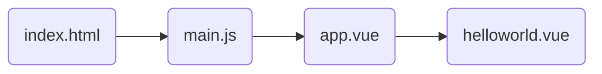

<div align="center" style= 'font-size: 48px;'>
    ubuntu下安装vue cli
</div>

# 一、安装环境

​		本文主要介绍vue脚手架工具vue-cli的安装。

```bash
luocang@luocang-SC:~$ sudo apt-get install nodejs
luocang@luocang-SC:~$ node -v
v10.19.0
luocang@luocang-SC:~$ sudo apt install npm
luocang@luocang-SC:~$ sudo npm install -g cnpm --registry=https://registry.npm.taobao.org
luocang@luocang-SC:~$ sudo cnpm install -g @vue/cli
luocang@luocang-SC:~$ vue -V
@vue/cli 4.5.11
luocang@luocang-SC:~$ npm config set registry https://registry.npm.taobao.org
```


# 二、构建项目

​		vue-cli构建element项目可以有两种方法，一种是使用vue ui的可视化界面生成，另外一种是vue create的方式生成，这里使用vue ui的方式生成。

## 1. 创建项目

​		使用vue-cli可以快速设置一个vue项目：

```bash
vue ui
```

		


​		使用该指令后会自动访问localhost:8000端口，不选择git初始化，preset选择手动，其中特性选择了vue版本，babel，router以及使用配置文件。Vue版本选择2.x即可。

​		上述一些列操作也可以使用vue create完成。

## 2. 运行项目

​		运行项目有两种方式，其实本质都是一样的。

​		第一种

```bash
 $ cd 01helloworld
 $ npm run serve
```

​		第二种	


然后访问```localhost:8080```就可以看到设置好的网页。


## 3.安装插件

​		在插件里面安装element，在依赖项中安装axios。


# 三、代码分析	

## 1.代码运行

​		使用```code ./```进入项目的目录文件夹下。

​		发现其目录文件结构如下：



​		修改```app.vue```：

```vue
<template>
  <div id="app">
    
    <el-row>
      <el-button>默认按钮</el-button>
      <el-button type="primary">主要按钮</el-button>
      <el-button type="success">成功按钮</el-button>
      <el-button type="info">信息按钮</el-button>
      <el-button type="warning">警告按钮</el-button>
      <el-button type="danger">危险按钮</el-button>
    </el-row>
  </div>
</template>

<script>

</script>

<style>
  #app {
    font-family: 'Avenir', Helvetica, Arial, sans-serif;
    -webkit-font-smoothing: antialiased;
    -moz-osx-font-smoothing: grayscale;
    text-align: center;
    color: #2c3e50;
    margin-top: 60px;
  }
</style>
```

​		更新后的网页如下：


​		说明element运行成功。


## 2.代码修改

​		修改element.js。

```js
import Vue from 'vue'
import { Button } from 'element-ui'
import { TableColumn } from 'element-ui'
import { Table } from 'element-ui'
import { Tag } from 'element-ui'
import { Popover } from 'element-ui'


Vue.use(Button)
Vue.use(TableColumn)
Vue.use(Table)
Vue.use(Tag)
Vue.use(Popover)
```

​		修改App.vue

```vue
<!--
 * @Author: your name
 * @Date: 2021-02-04 18:18:14
 * @LastEditTime: 2021-02-04 19:03:23
 * @LastEditors: Please set LastEditors
 * @Description: In User Settings Edit
 * @FilePath: /01helloworld/src/App.vue
-->
<template>
  <div id="app">
    
    <el-row>
      <el-button>默认按钮</el-button>
      <el-button type="primary">主要按钮</el-button>
      <el-button type="success">成功按钮</el-button>
      <el-button type="info">信息按钮</el-button>
      <el-button type="warning">警告按钮</el-button>
      <el-button type="danger">危险按钮</el-button>
    </el-row>

    <el-table :data="tableData" style="width: 100%">
      <el-table-column label="日期" width="180">
        <template slot-scope="scope">
          <i class="el-icon-time"></i>
          <span style="margin-left: 10px">{{ scope.row.date }}</span>
        </template>
      </el-table-column>
      <el-table-column label="姓名" width="180">
        <template slot-scope="scope">
          <el-popover trigger="hover" placement="top">
            <p>姓名: {{ scope.row.name }}</p>
            <p>住址: {{ scope.row.address }}</p>
            <div slot="reference" class="name-wrapper">
              <el-tag size="medium">{{ scope.row.name }}</el-tag>
            </div>
          </el-popover>
        </template>
      </el-table-column>
      <el-table-column label="操作">
        <template slot-scope="scope">
          <el-button size="mini" @click="handleEdit(scope.$index, scope.row)">编辑</el-button>
          <el-button size="mini" type="danger" @click="handleDelete(scope.$index, scope.row)">删除</el-button>
        </template>
      </el-table-column>
    </el-table>
  </div>
</template>

<script>
  // import HelloWorld from './components/HelloWorld.vue'

  // export default {
  //   name: 'app',
  //   components: {
  //     HelloWorld
  //   }
  // }

  export default {
    data() {
      return {
        tableData: [{
          date: '2016-05-02',
          name: '王小虎',
          address: '上海市普陀区金沙江路 1518 弄'
        }, {
          date: '2016-05-04',
          name: '王小虎',
          address: '上海市普陀区金沙江路 1517 弄'
        }, {
          date: '2016-05-01',
          name: '王小虎',
          address: '上海市普陀区金沙江路 1519 弄'
        }, {
          date: '2016-05-03',
          name: '王小虎',
          address: '上海市普陀区金沙江路 1516 弄'
        }]
      }
    },
    methods: {
      handleEdit(index, row) {
        console.log(index, row);
      },
      handleDelete(index, row) {
        console.log(index, row);
      }
    }
  }
</script>

<style>
  #app {
    font-family: 'Avenir', Helvetica, Arial, sans-serif;
    -webkit-font-smoothing: antialiased;
    -moz-osx-font-smoothing: grayscale;
    text-align: center;
    color: #2c3e50;
    margin-top: 60px;
  }
</style>
```

​		运行后的结果：


​		说明elementUI已经成功运行。